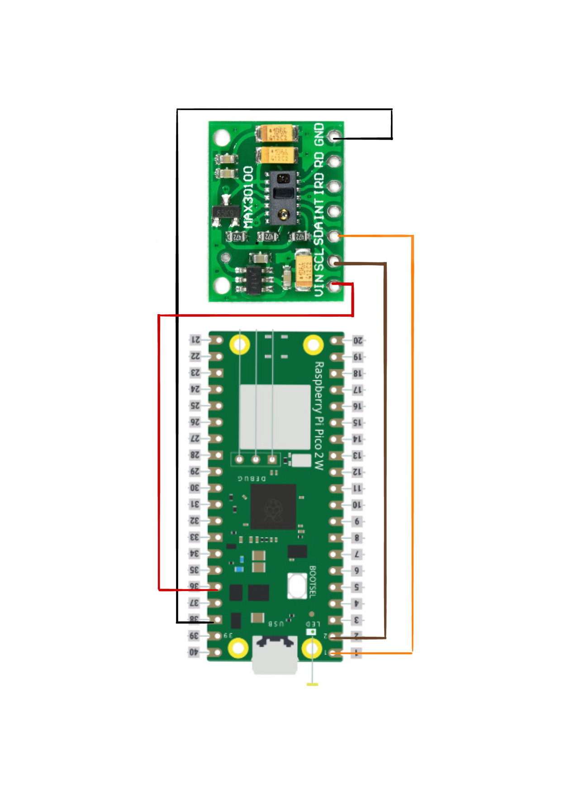

# PROY-2025-GRUPO5

Repositorio del grupo 5 para el proyecto del ramo *Proyecto Inicial* – 2025.

## 👥 Integrantes del grupo

| Nombre y Apellido | Usuario GitHub | Correo USM               | Rol          |
| ----------------- | -------------- | ------------------------ | ------------ |
| Catalina Saez | @crxtalyy      | csaezg@usm.cl | 202530036-2 |
| Constanza Osorio | @nini-ui     | cosorion@usm.cl | 202530040-0|
| Anibal Gonzalez | @anideelite      | agonzalezch@usm.cl | 202530017-6 |


## 📝 Descripción breve del proyecto

> *Music PIcker es una iniciativa que nace desde nuestro gusto en común, la música. Combina la tecnología, salud y el entretenimiento. 
Nuestro objetivo es desarrollar un sistema basado en una Raspberry Pi Pico 2 W que funcione como un reproductor de música según las emociones del usuario, determinadas a partir de su frecuencia cardíaca.
Queremos crear una experiencia personalizada que combine el bienestar emocional y tecnología, permitiendo que la música se adapte al ritmo de cada persona. 
Los elementos que utilizaremos para llevar a cabo el proyecto son:*

>*-Raspberry Pi Pico 2 W*

>*-Sensor de pulso*

>*-Reproductor de música local*

---

## 🎯 Objetivos

>- Objetivo general:
 >    - *Determinar, mediante la frecuencia cardíaca distintos estados de ánimo, como la música puede influenciar el comportamiento de estos, al entregar gracias a una Raspberry Pi Pico 2 W, una selección de canciones que estimulen el cambio anímico. Esto con el objetivo de que las personas reduzcan el estrés que está escondido.*

>- Objetivos específicos:
  >   - *Desarrollar un sistema que permita la lectura de la frecuencia cardíaca con una Raspberry Pi Pico 2 W.*
  >   - *Indagar sobre la relación que existe entre la frecuencia cardíaca y los diferentes estados anímicos.*
  >   - *Investigar de qué manera influye la música en los cambios de ánimo y como debe implementarse para producirlos.*
  >   - *Conseguir que la Raspberry Pi Pico 2 W entregue al usuario una determinada lista de reproducción musical, dependiendo tanto de su frecuencia cardíaca, cómo de su estado de ánimo.*

---

## 🧩 Alcance del proyecto

>*Como todo proyecto, "Music PIcker" busca entregar un servicio al usuario que lo utilice. Por ende se comprende que, en este caso, el receptor requiere conocer su frecuencia cardíaca para así proyectar su estado de ánimo a una playlist, dependiendo del resultado obtenido. Es por esta razón que se definieron objetivos que al ser desarrollados, entreguen un producto que pueda satisfacer las necesidades de quien lo requiera. Se entiende que también existen limitaciones, pues, al no contar con tecnología médica refinada, el pulso entregado será más una aproximación que una exactitud.*

---

## 🛠️ Tecnologías y herramientas utilizadas

>- *Lenguaje(s) de programación*
>    - *MicroPython*
>- *Microcontroladores*
>    - *Raspberry Pi Pico W 2*
>- *Sensores*
>   - *Sensor de pulso*

---

## 🗂️ Estructura del repositorio

```
/PROY-2025-GRUPO5
│
├── docs/               # Documentación general y reportes
├── src/                # Código fuente del proyecto
├── tests/              # Casos de prueba
└── README.md           # Este archivo
```

---

## 🧪 Metodología

>*Para desarrollar nuestro proyecto, utilizamos una metodología basada en un prototipo rápido. Nuestra prioridad fue construir un sistema funcional desde etapas tempranas, ir probando lecturas con el sensor y ajustar según los resultados (prueba-error)*

>*Seguimos un enfoque interactivo, desarrollado en varias versiones:*
>- *1. Primer prototipo: conexión básica entre el sensor y la Raspberry Pi.*
>- *2. Segundo prototipo: envío de datos al servidor y validación de la lectura en BPM.*
>- *3. Tercer prototipo: integración de la API de Spotify para vincular los datos a música.*

>*En cuanto al flujo de trabajo y el uso de Git, gestionamos el control de las versiones usando Git.
>- *Para el servidor, utilizamos un repositorio por separado*
>- *Cada funcionalidad (lectura del sensor, conexión a wifi, conexión al servidor, reproducción musical) se trabajó en ramas por separado.*
>- *Al finalizar cada parte, se hizo una Pull Request para fusionar a la rama principal (main), después de hacer las pruebas.*
>- *Lo mismo hicimos en la Raspberry Pi.*

---

## 💻 Instrucciones de uso

>*En la carpeta src se encuentran los códigos, uno de ellos para main en la Raspberry Pi Pico 2 W (funcionamiento del sensor y procesamiento de datos) y una carpeta con los códigos necesarios para hacer funcionar el servidor en la nube, en nuestro caso para Render.*

>- *Pasos a seguir:*
>    - *1.- Pruebas del sensor: según el diagrama de conexión que se encuentra abajo, se conecta la Raspberry Pi con el sensor, ambos se colocan en la breadboard y se conectan con los cables dupont macho-macho. Se hace funcionar el sensor y se verifica que tome datos.*
>    - *2.- Creación del servidor: (Dependiendo de donde se quiera hacer el servidor, en nuestro caso lo hicimos en la nube sin embargo se puede hacer un servidor desde un PC). Con el código que se encuentra en la carpeta de servidor, crear un nuevo repositorio especialmente para el servidor. Al entrar en Render se conecta el nuevo repositorio con Render y al configurarlo, este corra de acuerdo a este código.*
>    - *3.- API de Spotify: Entrar a la página y crear una API, completando los datos correspondientes, en el apartado de URIs completar con el link del servidor que entregó render anteriormente. Finalizado esto, se entregarán dos datos, Cliente ID y Client Secret, datos que deben ser añadidos a Variables Ambientales en el servidor junto a un apartado más de variable, llamado Redirect URI que es el link que fue añadido anteriormente a la API, esto conectará la cuenta de Spotify con el servidor.*
>    - *4.- Editar datos: Cada código tiene datos que deben ser modificados antes de correrlo, un ejemplo es el internet en el código de la Rasperry. Otros datos que pueden ser modificados también son las playlist definidas para cada estado de ánimo, esto queda completamente en el gusto personal, en la carpeta servidor/auto_player.py Se modifica playlist_uris con el link de la playlist que se prefiera.*
>    - *5.- Hacer funcionar todo: Luego de completar los datos anteriores debería estar todo listo para funcionar. Los pasos para hacer funcionar todo junto son: Desplegar el último commit en render, una vez actualizado el servidor entrar en el link e iniciar sesión con la misma cuenta con la que se creó la API, entrar a Spotify (¡importante si no se detecta la aplicación abierta no se reproducirá música), finalmente correr el código en la Raspberry Pi y poner el dedo en el sensor.*

>*Ya debería estar todo funcionando, solo quedá disfrutar de la música según tu ritmo cardíaco.*



---

## 📅 Cronograma de trabajo


>*[Carta Gantt](https://drive.google.com/file/d/1qpgkW8skJyOqvOBeiSnrYWa-JTEYBuSH/view?usp=sharing)*


---

## 📚 Bibliografía

>*[Enlace](https://google.com)*

>*[Web API Spotify](https://developer.spotify.com/documentation/web-api)*

>*[Interfaz del oximetro de pulso MAX30100](https://lastminuteengineers-com.translate.goog/max30100-pulse-oximeter-heart-rate-sensor-arduino-tutorial/?_x_tr_sl=en&_x_tr_tl=es&_x_tr_hl=es&_x_tr_pto=tc)*

---

## 📌 Notas adicionales

> *[Video Proyecto](https://youtu.be/E92vWoTAzts?si=Z2R7ICyxwBZdvsdc)*
